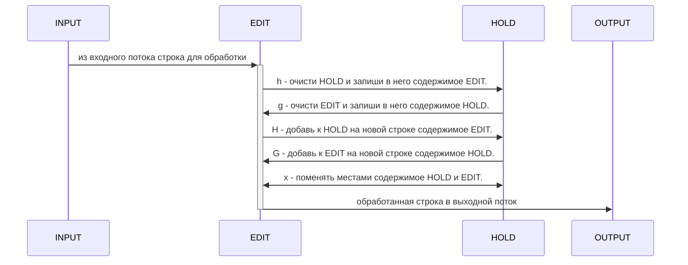

Примеры использования поисковых запросов POSIX

<!--more-->

Потоковый редактор SED. Обзор команд [h H g G x]


## Примеры с редактором SED
### h, H, g, G, x

```shell
╭─edge@bsd in ~ 
╰$ seq 12 | sed -Ene '/[27]/!{H;}' -e '/[27]/{g;p;a\
---
}'

1
--- 

1
3
4
5
6
--- 

1
3
4
5
6
8
9
10
11
--- 
```

Это смертельный номер!!!

У sed есть два буфера:
1. Буфер редактирования (на схеме EDIT)
2. Буфер удержания (на схеме HOLD)

В обычном режиме все происходит с буфером редактирования и его результаты выводятся в выходной поток командой `p`.

Но мы можем записать значение буфера редактирования (а это есть текущая строка в цикле обработки) в буфер удержания командой `h` с перезаписыванием буфера удержания или командой `H` с добавлением в новую строку буфера удержания.

Командой `g` мы очищаем буфер редактирования и записываем в него все, что есть в буфере удержания, а командой `G` добавляем к буферу редактирования содержимое буфера удержания.

Команда `x` --- меняет местами буфер удержания и буфер редактирования.




Первоначально буфер HOLD пустой, поэтому команду G часто используют как команду для добавления пустой строки в выходной поток.


Работа с HOLD --- это работа с ячейкой памяти для временного хранения промежуточных результатов.

Обзор документации по SED в разделе **Справочник**. [Подробнее..]({})


