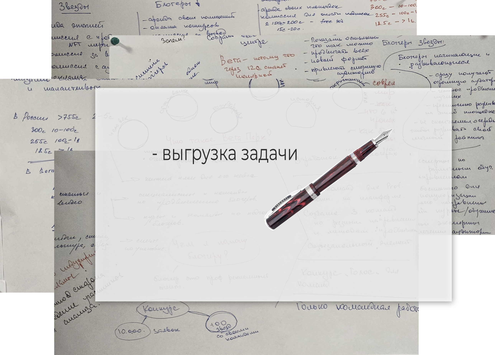

Основные этапы написания СЕО статьи для сайта.

<!--more-->


Не считаю данную статью исчерпывающей, но постарался описать, как я делаю СЕО статьи для сайтов.


## Для чего нужен СЕО?

Без лишней воды.

Правильно написанный текст, хорошо ищется поисковыми системами и экономит сотни тысяч рублей и других валют для того, чтобы появиться на первой странице поискового запроса в браузере.

SEO, или Search Engine Optimization, ― это оптимизация и продвижение сайта в поисковой выдаче для привлечения большего количества лидов. 



## Основные требования к СЕО тексту.

1. Желательный размер СЕО статьи около 20000 знаков.
2. Нежелательно пользоваться chatGPT и их братьями, потому что, поисковые системы уже тоже на них работают и начинают понимать, кем написана статья и понижают в поиске ваш сайт.
3. Уникальность текста и отсутствие воды. Очень хорошо эту тему проверяет сервис Text.ru.
4. Многократное повторение фраз с ключевыми словами по которым обычно выполняется поисковый запрос.
5. Разбиение текста на разделы и подразделы.
6. Раскрытие темы в каждом разделе и выдерживание человеко-читаемого стиля.
7. Хорошее оформление.
8. Оглавление и навигация.

> Я не претендую на полноту изложения требований к СЕО текстам, но я придерживаюсь этих. Мои тексты в работу к СЕО специалистам идут обычно без коррекции.

## Порядок работы

### Интервьюирование заказчика

Очень милая беседа и может быть даже не одна. 

Основная задача интервьюирования: выгрузить из мозга заказчика все аспекты его идеи, товара, услуги, проекта и т.д. для чего будет писаться статья или серия статей.


Иногда это приобретает масштаб подобных произведений:
 

### Определение семантического ядра будущего текста


Открываю ,  и другие сервисы и формирую большой список ключевых фраз.



Из этих фраз будет складываться будущий текст нашего произведения.

### Боли клиентов заказчика


Зачем клиенту заказчика нужен этот товар или услуга?


Составляю еще один перечень, который определит сюжетную линию текста.

Для составления этого списка помогает маленький опросник:

1. Кому нужна эта услуга/товар? (определяем целевую аудиторию --- ЦА)
2. Зачем это нужно (ЦА)?
3. Как часто это нужно ЦА?
4. Какие уникальные особенности заказчика по сравнению с конкурентами?
5. Какие есть истории реальных клиентов?
6. Где используется этот товар/услуга?
7. Сколько экономит?
8. Сколько зарабатывает?
9. Что достанется первым?
10. Сколько уже пользуются?

и т.д. в зависимости от темы.

### Творческий этап

1. Пишу статью
2. Проверяю на ошибки
3. Расставляю заголовки 
4. Добавляю убедительные картинки
5. Отправляю для загрузки на сайт.

## Начнём?


Пишем на почту 
 заявку и получаем хороший документ.

