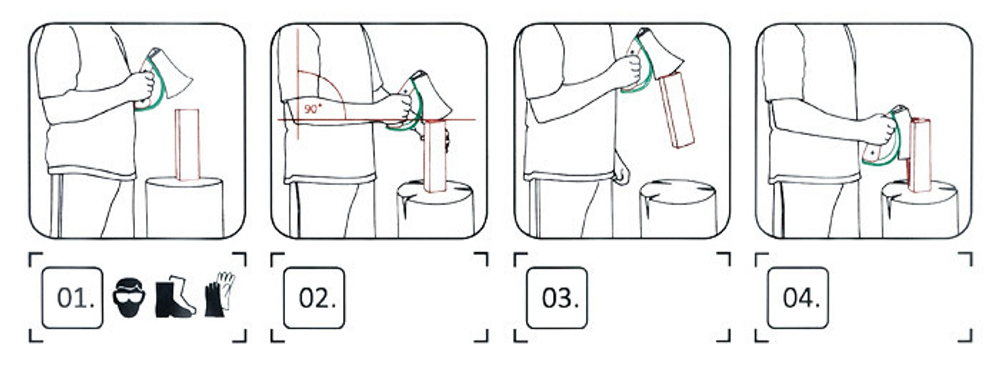
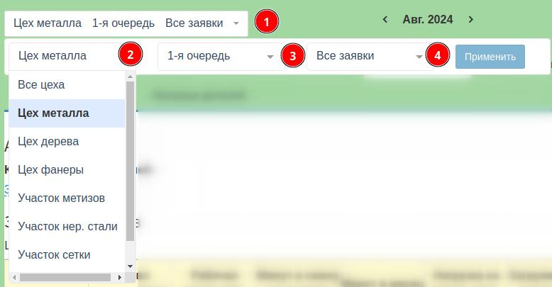

Основные этапы создания руководство пользователя 

<!--more-->


Не воспринимайте все буквально, но это мое личное мнение, как должно выглядеть руководство пользователя.


## Ракурс. Откуда лучше посмотреть?

Руководство пользователя с незапамятных времен превратилось из "предания" в "писания".

Раньше то, как было? 

Позовет мастер ученика и говорит: "Вот топор. Берешь его за топорище. Размахиваешься, да не так шибко. И лезвием ударяешь в чурбан. Понял?"

Конечно, поймет. Может и не с первого раза, но повторит, разок-другой и уже не хуже мастера машет.
 

>Если такие инструкции были к каждому изделию, да еще разукрашенные...


Я к тому, чтобы инструкции писали понятным языком, а в самом начале правильно определились с терминологией, что и как называется.


Руководство пользователя должно быть как диалог мастера с учеником. И в этом деле нисколько не помеха ГОСТы. 

## Основные ошибки при написании руководства пользователя

 --- сухой и формальный подход. Заполнили структуру, как требуется по шаблону, отчитались и трава не расти. 

Такое явление особенно часто бывает при переводах. Особенно, когда переводчик вообще не из этой темы. 

>У меня был такой опыт в 2000-х, когда я читал медицинскую литературу по Остеопатии, переведенную человеком, вообще не понимающем в медицине. Было ощущение, что чинят утюг, а не человека лечат.

 --- отсутствие словаря терминов и определений. Любая инструкция для пользователя --- это разговорник для иностранца.

И не нужно стесняться сделать такой словарик в самом начале или в конце и потом еще несколько раз повториться в сносках на каждой страничке инструкции и описать новые и специальные слова. 

А если вы делаете электронную инструкцию, то обязательно по каждому такому слову сделайте маленькую статью с определением и ссылочку прямо в тексте[^1].
[^1]: Чтобы небыло лишних вопросов, ставьте ссылки прямо при описании процесса.

Чем и удобен электронный справочник, что по ссылке легко перейти, прочитать определение и также легко вернуться к тому месту, где прервалось чтение.

Если ваш читатель не понял в предложении какое-то слово, то он уже не понял смысл всего предложения. А если он на странице не понял смысл одного предложения, то он уже не понял смысл всей страницы и т.д.

 --- инструкцию пишут без наглядных примеров и рисунков. 

Каждый сталкивался с такой проблемой. Чтобы разобрать из текста и представить себе визуально, о чем идет речь. Это работа не для слабонервных.

Куда проще:
 - кинул картинку;
 - на картинке расставил цифры в кружочках;
 - а после картинки дал описание, что означает каждая цифра.

 

А если нужно описать последовательность действий. То в этом случае вообще не скупитесь на картинки с цифорками. Лучше них никто пользователю не расскажет.

 --- перестаньте умничать! Вы не диссертацию пишете. Люди, которые вас будут читать (я имею ввиду вашу инструкцию) ох как не нуждаются в теории. Им бы скорее сделать все и больше не отвлекаться.

Пишите простым языком. Выбирайте стиль изложения не назидательный, а представляйте себе диалог доброго мастера со своим учеником.

И опять ссылки! Если вы понимаете, что в этом разделе нужно пользователю подробно ознакомиться с другим разделом, так ему и напишите (см. раздел 
выше ). А еще лучше указать номер раздела и страницу (если это бумажный вариант).

 --- не стесняйтесь делать различные справочники и приложения со ссылками на таблицы, рисунки, термины.

Структурируйте большие разделы документации и превращайте их в маленькие **"шпаргалки"** без лишней воды и также со ссылками на более подробное описание.

Так их и называйте:
 - Приложение 1: Список таблиц в документе
 - Приложение 2: Список иллюстраций в документе
 - Приложение 3: Резюме по каждому разделу
   - 3.1 Резюме по разделу 1
   - 3.2 Резюме по разделу 2
   - 3.3 Резюме по разделу 3
 - Приложение 4: Термины и определения
 - Приложение 5: Сокращения (обычно ставят в начале документа, но в электронном не обязательно).
 
 И другие приложения.

## Структура

1. Введение --- расскажите о чем ваш документ и о чем вся система, которую описываем, но кратко.

2. Немного подробнее **Назначение и условия применения «АС»** про которую будем говорить в этом документе.

   - Перечень функций, входящих в состав описываемой системы
   - При каких условиях возможно устойчивое функционирования описываемой системы

3. Подготовка к работе
   - Первичные настройки
   - Порядок запуска системы/устройства/приложения
4. Описание операций

>Это основной раздел. С этим разделом будет работать ваш читатель. Поэтому не скупитесь на все те предложения, которые я описал (см. раздел  выше ).

Для правильного описания этого раздела нужно: 

 --- составить предварительно все технологические операции, которые выполняются пользователем с применением этого устройства /программы /приложения /системы. 

 --- на каждую такую технологическую операцию желательно нарисовать схему с пошаговыми действиями.

 --- подробно описать каждый шаг.

Если от вас требуют, чтобы в инструкции было описание функций и экранов системы, сделайте приложение с перечнем функций и перечнем экранов, со ссылками на страницы документа.

Пользователь выполняет технологические операции и он никогда не вспомнит на какой странице искать описание этого экрана, он вспомнит, на какой операции у него возникли проблемы.

4. Обязательный раздел **Устранение аварийных ситуаций**. 

Даже если не может быть. Сделайте этот раздел и напишите номер телефона куда позвонить если вдруг что.

5. Для любителей поучений, сделайте раздел, что еще нужно почитать пользователю, чтобы хорошо управляться с вашей системой, может курс высшей математики и физики под редакцией Яглома Исаака Моисеевича и Зельдовича Якова Борисовича.

6. И обязательно контакты.

## Как я делаю руководство пользователя

### При подготовке документов я использую:
 - издательскую систему LATEX
 - редактор EMACS
 - графический редактор XARA, INKSCAPE
 - редактор BPMN
 - редактор построения моделей IDEF0…
 - конструктор статических сайтов HUGO
>Очень люблю Latex, в нем получаются изящные и структрурированные PDF документы.

### Работаю на операционных системах:
 - ARCH Linux
 - FreeBsd
 - Ubuntu/Debian
 - Windows
 - Mac OS
>Очень люблю Freebsd. Очень проста, а главное в ней работает всё, что мне нужно.

### При создании документации использую ГОСТы и стандарты
 - ЕСКД
 - ЕСПД
 - Международные стандарты: ISO, ASME, JIS
>ГОСТы --- это наше всё.

## Начнём?


Пишем на почту 
 заявку и получаем хороший документ.


