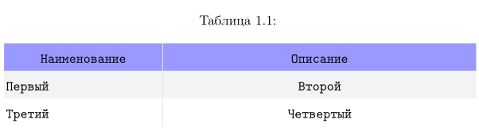

+++
title = 'Пакет longtable'
linktitle = ''
date = 2024-11-15T15:41:23+03:00

categories = 'docs'
series = 'latex'
tags = ['documentation','table']
summary = 'Применение longtable с тонкими настройками в Latex'
description = ''
images = ['longtable.png']
+++
## Пакет Longtable

### Размещение пакета
https://ctan.org/pkg/longtable

### Официальная документация
https://mirror.macomnet.net/pub/CTAN/macros/latex/required/tools/longtable.pdf

### Установка

```tex 
\usepackage{longtable} %собственно сам пакет для работы с таблицами
\usepackage{xcolor} %чтобы работать с цветами
\usepackage{colortbl} %чтобы работать с цветными таблицами
```

### Особенности

Полная приемственность от `tabular` и `tabularx`, поэтому можно только им и пользоваться.

Очень понадобятся первоначальные настройки для формата таблицы
```tex
\newcolumntype{C}[1]{>{\columncolor{white}\ttfamily\centering\arraybackslash}p{#1cm}}
\newcolumntype{R}[1]{>{\columncolor{white}\ttfamily\raggedleft\arraybackslash}p{#1cm}}
\newcolumntype{L}[1]{>{\columncolor{white}\ttfamily\raggedright\arraybackslash}p{#1cm}}
\newcolumntype{B}[1]{>{\columncolor{white}\ttfamily\bfseries\raggedright\arraybackslash}p{#1cm}}

\renewcommand{\tabcolsep}{0.05cm}
\renewcommand{\arraystretch}{1.7}

```
`\newcolumntype` похожа на `\newcommand` но только для настройки таблиц. Работает со всеми пакетами расширяющие стандартый пакет таблиц: `xtab`, `xtabular`, `tabularx` и `longtable`.

https://ctan.org/pkg/tabularx
https://mirror.truenetwork.ru/CTAN/macros/latex/required/tools/tabularx.pdf

оттуда и возьмем описание команд:

### \arraybackslash
`\raggedright, \raggedleft, \centering` --- после этих команд изменяется поведение команды `\\` и `\\*`, вот, чтобы этого не произошло и применяем команду `\arraybackslash`.

`>{\raggedright\arraybackslash}X`

### \newcolumntype

определяет новые параметры колонки и назначает их переменной `Y` или какую напишем, но только из одной буквы. Мне алфавита хватало всегда. 
`\newcolumntype{Y}{>{\small\raggedright\arraybackslash}X}`

после знака `{>` пишем любые команды для определения шрифта, цвета, выравнивания и т.д. Обычно это удобно связывать с шириной колонки и передавать значение через переменную в p{\#1}.

Количество переменных может быть любое, главное в них самому не запутаться.

После определения новых типов колонок их можно использовать в заголовке описания таблицы наравне с `lcrpm`

### \tabularxcolumn

Изменяет тип колонки `X`

`\newcommand{\tabularxcolumn}[1]{p{#1}}` --- соответствует \parbox[t] --- и определено по умолчанию
`\renewcommand{\tabularxcolumn}[1]{>{\small}m{#1}}` --- соответствует \parbox[m] --- контент выравнивается по центру и типа так я могу переопределить, но у меня ничего не получилось, зато мои настройки \newcolumn работают шикарно.

### ширина колонки

Умный Latex по умолчанию всегда пытается создать одинаковые колонки с размером `\hsize`, но мы можем переопределить пропорционально ширину каждой колонки. Первая будет половина от стандартной ширины, а вторая в 3 раза больше.

`{>{\hsize=.5\hsize\linewidth=\hsize}X >{\hsize=1.5\hsize\linewidth=\hsize}X}`

Дальше tabularx упрощает работы со сносками. Но я на этом пакете заканчиваю и перехожу к longtable.

### Сделал себе мастер таблицу и закатал в `yasnippet`
```tex
# -*- mode: snippet -*-
# name: longtable
# key: longtable
# --
%%%%%%%%%%%%%%%%%%%%%%%%%%%%%%%%LONGTABLE
\begin{center}
\rowcolors{2}{gray!10}{white} \\arrayrulecolor{gray!20} %раскрасим в два цвета строки
\begin{longtable}{c|c} %описание таблицы

%%%%%%%%%%%%%%% заголовок на первой странице
\caption[Название таблицы короткое]{Название таблицы длинное\label{tab:}}\\\
\rowcolor{blue!40} %раскрасим заголовок таблицы
\multicolumn{1}{c}{Наименование} % название первой колонки
& \multicolumn{1}{c}{Описание} % название второй колонки
% при большем количестве колонок последнюю строчку повторить столько же раз
% готовый раздел скопировать в раздел Заголовок на второй странице
\endfirsthead % конец заголовка
%%%%%%%%%%%%%%%%% конец заголовка на первой странице

%%%%%%%%%%%%%%% Заголовок на второй странице
\caption{продолжение таблицы на следующей странице}\\\
\rowcolor{blue!40}
\multicolumn{1}{c}{Наименование}
& \multicolumn{1}{c}{Описание}
\endhead %конец заголовка
%%%%%%%%%%%%%%%%% конец заголовка на второй странице

%%%%%%%%%%%%%%%%%%%%% BODY TABLE
Первый & Второй\\\\
Третий & Четвертый\\\\
%%%%%%%%%%%%%%%%%%%%%

\end{longtable}
\end{center}


```

 

### Команды для высоты строк и отступов между колонками
```tex
\renewcommand{\tabcolsep}{0.05cm}
\renewcommand{\arraystretch}{1.7}
```
 - первая определит отступ между колонками
 - вторая высоту строк в таблице
 
 >[!INFO]
 > Собственно мне всего перечисленного хватало практически на 90% всех таблиц.
 
 ## Длина таблицы на странице
 
 По умолчанию длина таблицы 20 строк, но можно изменить с помощью команты
 ```tex
 \setcounter{LTchunksize}{10}
 ```
 и будет 10!
 
 ## Изменить нумерацию таблиц
 
` \renewcommand\LTcaptype{⟨counter ⟩}`

## Header & Footer

1. У таблицы могут быть первый Header и после его описания нужно поставить `\endfirsthead` 
2. После определения заголовков на 2-й и следующих таблицах поставить `\endhead`.
3. Если таблица на одной странице, то пункт 2 не нужен.
4. `\endfoot` также заканчивает описание последней строки таблицы на странице 
5. `\endlastfoot` описывает последнюю строку таблицы

## \сaption

 `\caption{...}` команда эквивалентна \multicolumn{n}{c}{\parbox{\LTcapwidth}{...}}
 она просто объединяет все колонки и пишется как полноценная строка таблицы.
 
` \caption[Опциональное имя, используется в списке таблиц]{Полноценное имя таблицы\label{long}}.`

## \multicolumn

объединяет колонки `\multicolumn{numcols}{cols}{text}`

1. количество объединяемых колонок
2. формат колонок `lcrmp`
3. Собственно текст в этой ячейке с применением всех возможных комманд и боксов, а также `\multirow` для объединения строк. Но для нее нужно подключить пакет `\usepackage{multirow}`

## \kill

делаем строку для определения ширины столбцов и вместо `\\` ставим `\kill`. Строка не будет отображаться в таблице, но ширину настроит.

## Выравнивание таблицы на странице

`LTleft` и `LTright`
```tex
\setlength\LTleft\parindent 
\setlength\LTright\fill
```

устанавливаем отступ для всей таблицы слева и справа, но один параметр нужно сотавлять тягучим `\fill`

```tex
\setlength\LTleft{0pt} 
\setlength\LTright{0pt} 
\begin{longtable}{@{\extracolsep{...}}...}
```

`\extracolsep` --- делает резиновым столбец.

## Сводная таблица
**Параметры**
\LTleft | Glue to the left of the table.| (\fill) 
--------|-------------------------------|--------
\LTright| Glue to the right of the table.| (\fill) 
\LTpre |Glue before the table. |(\bigskipamount) 
\LTpost |Glue after the table. |(\bigskipamount) 
\LTcapwidth |The width of a parbox containing the caption.| (4in) 
\LTchunksize |The number of rows per chunk. |(20)  

**Optional arguments to \begin{longtable}**

none| Position as specified by \LTleft and \LTright. 
----|------
[c] |Centre the table. 
[l] |Place the table flush left. 
[r] |Place the table flush right.  

**Commands to end table rows**
\\ |Specifies the end of a row
----|----
\\\\[⟨dim⟩] |Ends row, then adds vertical space (as in the tabular environment). 
\\\\* |The same as \\ but disallows a page break after the row. 
\tabularnewline | Alternative to \\\\ for use in the scope of \raggedright and similar commands that redefine \\\\. 
\kill | Row is ‘killed’, but is used in calculating widths. 
\endhead | Specifies rows to appear at the top of every page. 
\endfirsthead | Specifies rows to appear at the top of the first page.
\endfoot | Specifies rows to appear at the bottom of every page. 
\endlastfoot| Specifies rows to appear at the bottom of the last page.  

**Longtable caption commands**  
\caption{⟨caption⟩}| Caption ‘Table ?: ⟨caption⟩’, and a ‘⟨caption⟩’ entry in the list of tables. 
------------|----------------
\caption[⟨lot⟩]{⟨caption⟩} | Caption ‘Table ?: ⟨caption⟩’, and a ‘⟨lot⟩’ entry in the list of tables. 
\caption[]{⟨caption⟩} | Caption ‘Table ?: ⟨caption⟩’, but no entry in the list of tables. 
\caption*{⟨caption⟩} | Caption ‘⟨caption⟩’, but no entry in the list of tables.  

**Commands available at the start of a row** 
\pagebreak| Force a page break. 
---------|-----------
\pagebreak[⟨val ⟩] | A ‘hint’ between 0 and 4 of the desirability of a break. 
\nopagebreak| Prohibit a page break. 
\nopagebreak[⟨val ⟩]| A ‘hint’ between 0 and 4 of the undesirability of a break. 
\newpage| Force a page break.  

**Footnote commands available inside longtable**  
\footnote| Footnotes, but may not be used in the table head & foot. 
------|----------
\footnotemark | Footnotemark, may be used in the table head & foot. 
\footnotetext| Footnote text, use in the table body.  

**Setlongtables**  
\setlongtables| Obsolete command. Does nothing now.
-----|--------

## Multirow замолвите слово

Объединяет строки в таблице

Подключить через команду
```tex
\usepackage{multirow}
```

`\multirow[〈vpos 〉]{〈nrows 〉}[〈bigstruts 〉]{〈width 〉}[〈vmove 〉]{〈text 〉}`

 - **vpos** --- `tcb` выравнивает текст в общей ячейке по [t] [c] [b] (необязательный параметр)
 - **nrows** --- количество строк 
 - **bigstruts** --- это распорки или больше похоже на заполнение текста (я не использовал)
 - **width** --- ширина ячейки с текстом. Обычно (*), но если используем \multirow то не все колонки могут быть заполнены текстом
 - **vmove** --- это как \raisebox --- поднимает текст вверх или вниз. Удобная штука. Можно отрицательные и положительные значения.
 - **text** --- собственно сам текст
 
` \multicolumn{2}{c}{\multirow{3}{*}{Multi-multi}}` --- с multirow использовать только в таком порядке, а не наоборот.
>[!NOTE]
>В этом пакете еще есть утилиты для работы с большими скобками на объединенные строки.
