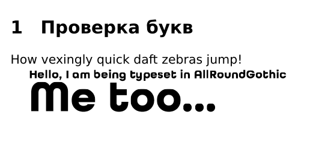

# Удивительное путешествие в мир создания интегрированных шрифтов в Latex

История началась с французской компании, которая попросила меня написать несколько документаций на свои изделия.

Так как я сначала подумал,что отделаюсь легким испугом, то первую работу сделал в XARA. Замечательный редактор, но когда в моем документе перевалило за 50 страниц, я понял, что ошибся с выбором инструмента.

Потом было несколько документов по 4-8 страниц. Что не составило проблем сделать в XARA.

Но когда дело дошло до очередного 80-ти страничного документа, я решил просто сделать в Latex.

Эта компания использовала свои фирменные шрифты, поэтому шрифты скачал в интернет, подключил модуль `\usepackage{fontspec}` и вуаля!!!

``` tex
\setmainfont{AllRoundGothic-Book}[
  BoldFont = AllRoundGothic-Bold ,
  ItalicFont = AllRoundGothic-BookOblique ]
\setsansfont{AllRoundGothic-XLig}
\setmonofont{Calibri}[
Extension = .ttf ,
BoldFont = Calibri_bold]      % задаёт \sffamily, шрифт без засечек

```

Настроил цвета через пакет `\usepackage{xcolor}`

``` tex
%%%%%%%%% COLOR %%%%%%%%%%%%%%%5
\definecolor{BleuProfond}{RGB}{7,29,73}%#071D49
\definecolor{BleuLBA}{RGB}{65,182,230}
\definecolor{GrisA}{RGB}{37,40,42}
\definecolor{GrisC}{RGB}{178,180,178}

```

Подключил нужные раскладки и настроил свои `fontfamily`

``` tex
\newfontfamily\boldfont{AllRoundGothic-Bold}
\newfontfamily\demifont{AllRoundGothic-Demi}
\newfontfamily\demifontwhite{AllRoundGothic-Demi}[Color = white]
\newfontfamily\mediumfont{AllRoundGothic-Medium}
\newfontfamily\boldfontbleu{AllRoundGothic-Bold}[Color = BleuProfond]
\newfontfamily\boldfontlba{AllRoundGothic-Bold}[Color = BleuLBA]
\newfontfamily\boldfontwhite{AllRoundGothic-Bold}[Color = white]

\newfontfamily\lc[Scale=MatchLowercase]{AllRoundGothic-Demi}[Color = BleuProfond]
\newfontfamily\uc[Scale=MatchUppercase]{AllRoundGothic-Demi}
\newfontfamily\ac[Scale=MatchAveragecase]{AllRoundGothic-Demi}
\newfontfamily\numamco{Calibri}
```

Собственно все!

Дальше рутина по созданию стиля страницы. Очень приятный `XELATEX` с которым мы достаточно быстро справились с поставленной задачей (убрал только привычный мне `%\usepackage{hyperref}`), потому-что на него странно ругался компилятор. (вычислил эксперементально).

Но все мои познания подключения шрифтов начались тогда, когда заказчик попросил сделать оглавление кликабельное с возможностью переходить по ссылкам на страницы.


И ВОТ ЗДЕСЬ НАЧАЛОСЬ!


Оказывается не `XELATEX` не `LUALATEX` при всей своей красоте поддержки TrueType шрифтов напрямую, отказываются работать с `\usepackage[xetex]{hyperref}` даже в таком варианте.

## Копирую шрифты в папку проекта

Есть варианты создать свою структуру и прописать настройки к ней, но в этом варианте я ограничиваюсь настройкой в рабочей директории.

Подключать буду три шрифта:

	- AllRoundGothic-Bold.ttf 
	- AllRoundGothic-Book.ttf 
	- AllRoundGothic-Demi.ttf 


### Подготовительные мероприятия
Нахожу в Latex (T1-WGL4.enc) на Manjaro он спрятался в `/opt/texlive/2024/texmf-dist/fonts/enc/ttf2pk/base`

Его тоже копирую в рабочуюдиректорию, чтобы ничего не потерялось. Для кирилических шрифтов копируем `T2A.enc`, он находится по соседству: `/opt/texlive/2024/texmf-dist/fonts/enc/t2`.

Теперь все готово для подключения.

### Создаю TeX Font Metrics (tfm)

Файлы с расширением `tfm` хранят необработанные шрифты, а  файлы vpl  виртуальные шрифты. 

``` shell
ttf2tfm AllRoundGothic-Demi.ttf -q -T T1-WGL4.enc -v ecAllRoundGothic-Demi.vpl recAllRoundGothic-Demi.tfm >> ttfonts.map
ttf2tfm AllRoundGothic-Bold.ttf -q -T T1-WGL4.enc -v ecAllRoundGothic-Bold.vpl recAllRoundGothic-Bold.tfm >> ttfonts.map
ttf2tfm AllRoundGothic-Book.ttf -q -T T1-WGL4.enc -v ecAllRoundGothic-Book.vpl recAllRoundGothic-Dook.tfm >> ttfonts.map

```
Можно посмотреть в `ttfont.map`, должно получиться что-то вроде:

```shell
recAllRoundGothic-Bold   AllRoundGothic-Bold.ttf Encoding=T1-WGL4.enc
recAllRoundGothic-Book   AllRoundGothic-Book.ttf Encoding=T1-WGL4.enc
recAllRoundGothic-Demi   AllRoundGothic-Demi.ttf Encoding=T1-WGL4.enc
```


Чтобы создать наклонные версии обычного и жирного шрифта, команду следует расширить следующим образом:

``` shell
ttf2tfm AllRoundGothic-Book.ttf -q -T T1-WGL4.enc -s .167 -v ecAllRoundGothic-Book.vpl recAllRoundGothic-Dook.tfm >> ttfonts.map
```


Но я так не делал, потому-что было не нужно.

### Создаю Virtual Fonts (vf)

``` shell
vptovf ecAllRoundGothic-Demi.vpl ecAllRoundGothic-Demi.vf ecAllRoundGothic-Demi.tfm                                     
vptovf ecAllRoundGothic-Bold.vpl ecAllRoundGothic-Bold.vf ecAllRoundGothic-Bold.tfm                                     
vptovf ecAllRoundGothic-Book.vpl ecAllRoundGothic-Book.vf ecAllRoundGothic-Book.tfm                                     
```

Но если бы я создавал какой-нибудь times, то нужно было создавать по всем законам толстые, наклонные и т.д.

``` shell
vptovf ectimes.vpl ectimes.vf ectimes.tfm
vptovf ectimesi.vpl ectimesi.vf ectimesi.tfm
vptovf ectimesbd.vpl ectimesbd.vf ectimesbd.tfm
vptovf ectimesbi.vpl ectimesbi.vf ectimesbi.tfm
vptovf ectimeso.vpl ectimeso.vf ectimeso.tfm
vptovf ectimesbdo.vpl ectimesbdo.vf ectimesbdo.tfm
```

### Что имеем по итогу?

``` shell
-rw-r--r-- 1 edge edge     555 ноя 12 16:31 ecAllRoundGothic-Bold.log
-rw-r--r-- 1 edge edge    1792 ноя 12 16:26 ecAllRoundGothic-Bold.tfm
-rw-r--r-- 1 edge edge    1784 ноя 12 16:26 ecAllRoundGothic-Bold.vf
-rw-r--r-- 1 edge edge   22500 ноя 12 16:19 ecAllRoundGothic-Bold.vpl
-rw-r--r-- 1 edge edge    1780 ноя 12 16:26 ecAllRoundGothic-Book.tfm
-rw-r--r-- 1 edge edge    1784 ноя 12 16:26 ecAllRoundGothic-Book.vf
-rw-r--r-- 1 edge edge   22365 ноя 12 16:20 ecAllRoundGothic-Book.vpl
-rw-r--r-- 1 edge edge    1788 ноя 12 16:25 ecAllRoundGothic-Demi.tfm
-rw-r--r-- 1 edge edge    1784 ноя 12 16:25 ecAllRoundGothic-Demi.vf
-rw-r--r-- 1 edge edge   22434 ноя 12 16:21 ecAllRoundGothic-Demi.vpl
```

`del *.vpl` они нам больше не нужны. Из них создали `*.vf`

Дальше размещаем по структурам каталогов Latex для постоянного использования или ничего не делаем, а все храним в рабочей папке. И все будет работать.

## Вместо заключения

В  latex вставляем такие простые вещи:

``` tex
\font\myfont=ecAllRoundGothic-Bold
\font\mybigfont=ecAllRoundGothic-Bold at 36pt
\font\bookfont=ecAllRoundGothic-Book
\font\demifont=ecAllRoundGothic-Demi
\myfont Hello, I am being typeset in AllRoundGothic

\mybigfont Me too...

```

или назначаем по умолчанию, как описывал раньше.

Но, получаем:



## Для постоянного использования шрифта

Создаем файл `.fd` я этого не делал, но из образца записываю. Там подключали times.

``` tex
\ProvidesFile{t1tnr.fd}[Put your description of font here]

\DeclareFontFamily{T1}{tnr}{}

\DeclareFontShape{T1}{tnr}{b}{n}{<->ectimesbd}{}
\DeclareFontShape{T1}{tnr}{b}{sl}{<-> ectimesbdo}{}
\DeclareFontShape{T1}{tnr}{b}{it}{<-> ectimesbi}{}

\DeclareFontShape{T1}{tnr}{m}{n}{<-> ectimes}{}
\DeclareFontShape{T1}{tnr}{m}{sl}{<-> ectimeso}{}
\DeclareFontShape{T1}{tnr}{m}{it}{<-> ectimesi}{}

\DeclareFontShape{T1}{tnr}{bx}{n}{<->ssub * tnr/b/n}{}
\DeclareFontShape{T1}{tnr}{bx}{sl}{<->ssub * tnr/b/sl}{}
\DeclareFontShape{T1}{tnr}{bx}{it}{<->ssub * tnr/b/it}{}

\endinput
```

Затем использование в документе будет выглядеть:

``` tex
documentclass{article}
\begin{document}
\usefont{T1}{tnr}{m}{sl} 

Hello, I am being typeset in Times New Roman Slanted 

\end{document}
```

Или прописать прямо в преамбуле

``` tex
\documentclass{article}

\renewcommand{\encodingdefault}{T1}
\renewcommand{\rmdefault}{tnr}

\begin{document}

Hello, I am being typeset in \textsl{Times New Roman Slanted} 

\end{document}
```
Проверяем:

``` shell
pdftex story

This is pdfTeX, Version 3.141592653-2.6-1.40.26 (TeX Live 2024) (preloaded format=pdftex)
 restricted \write18 enabled.
entering extended mode
(/opt/texlive/2024/texmf-dist/tex/plain/knuth-lib/story.tex [1{/opt/texlive/202
4/texmf-var/fonts/map/pdftex/updmap/pdftex.map}])

*\bye
```
## Подключение шрифтов Adobe (afm)

Создаем `afm` шрифты
``` shell
ttf2afm -e T1-WGL4.enc -o rectimes.afm times.ttf
ttf2afm -e T1-WGL4.enc -o rectimesi.afm timesi.ttf
ttf2afm -e T1-WGL4.enc -o rectimesbd.afm timesbd.ttf
ttf2afm -e T1-WGL4.enc -o rectimesbi.afm timesbi.ttf
```

Создаем `tfm` и `map`
``` shell
afm2tfm rectimes.afm -T T1-WGL4.enc rectimes.tfm >>winfonts.map
afm2tfm rectimesi.afm -T T1-WGL4.enc rectimesi.tfm >>winfonts.map
afm2tfm rectimesbd.afm -T T1-WGL4.enc rectimesbd.tfm >>winfonts.map
afm2tfm rectimesbi.afm -T T1-WGL4.enc rectimesbi.tfm >>winfonts.map
afm2tfm rectimes.afm -T T1-WGL4.enc -s .167 rectimeso.tfm >>winfonts.map
afm2tfm rectimesbd.afm -T T1-WGL4.enc -s .167 rectimesbdo.tfm >>winfonts.map
```

Редактируем `map` файл

``` shell
rectimes TimesNewRomanPSMT " T1Encoding ReEncodeFont " <times.ttf T1-WGL4.enc
rectimesi TimesNewRomanPS-ItalicMT " T1Encoding ReEncodeFont " <timesi.ttf T1-WGL4.enc
rectimesbd TimesNewRomanPS-BoldMT " T1Encoding ReEncodeFont " <timesbd.ttf T1-WGL4.enc
rectimesbi TimesNewRomanPS-BoldItalicMT " T1Encoding ReEncodeFont " <timesbi.ttf T1-WGL4.enc
rectimeso TimesNewRomanPSMT " .167 SlantFont T1Encoding ReEncodeFont " <times.ttf T1-WGL4.enc
rectimesbdo TimesNewRomanPS-BoldMT " .167 SlantFont T1Encoding ReEncodeFont " <timesbd.ttf T1-WGL4.enc
```

Далее можно разложить по правильным директориям или оставить в рабочей дирректории.
## У Latex есть много своих встроенных шрифтов

Подключаем 
```tex
\usepackage{DejaVuSans}
\renewcommand*\familydefault{\sfdefault} 
``` 
и пользуемся без геммороя.
