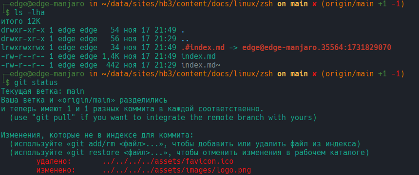

Командная оболочка ZSH т все о ней

<!--more-->

## Установка по умолчанию ZSH

Проверить текущую оболочку 
```sh
$ echo $SHELL
```

Проверить какие оболочки установлены
```sh
chsh -l
```

Установить по умолчанию zsh:
```sh
chsh -s /bin/zsh/
```

Если не установлен, то в Manjaro выполнить
```sh
sudo pacman -S zsh
zsh
```

если скрипт не запустился, то

```sh
autoload -Uz zsh-newuser-install
zsh-newuser-install -f
```

## Поставим OH-MY-ZSH

```sh
sh -c "$(curl -fsSL https://raw.githubusercontent.com/ohmyzsh/ohmyzsh/master/tools/install.sh)"
```
Читаем документацию https://github.com/ohmyzsh/ohmyzsh/wiki

## Редактируем `~/.zshrc`

`1. export ZSH="$HOME/.oh-my-zsh"` --- путь к настройкам `oh-my-zsh`

`2. ZSH_THEME="strug"` --- тема оформления shell-а.
 


// 

plugins=(git
    bundler
    archlinux
    copyfile
	copybuffer
    copypath
    cp
    emacs
    node
    npm
    qrcode
    rsync
)



Продолжение настройки: подключаем плагины

`19. source $ZSH/oh-my-zsh.sh` --- определяю источник для доступа к репозиторию `oh-my-zsh`

`20. EDITOR='emacs'` --- назначаю редактор по умолчанию `Emacs`

`21. [[ -s /home/edge/.autojump/etc/profile.d/autojump.sh ]] && source /home/edge/.autojump/etc/profile.d/autojump.sh
` --- подключаю модуль `autojump` т.к. он отказался подключаться по умолчанию и его пришлось устанавливать в ручную.


О каждом модуле подробнее


### autojump



Прыгает по директориям. Очень удобно.


Установка из репозитория https://github.com/wting/autojump

настройка обязательно написать в строке ~/.zshrc
```sh
[[ -s /home/edge/.autojump/etc/profile.d/autojump.sh ]] && source /home/edge/.autojump/etc/profile.d/autojump.sh
```
1. `j foo` --- быстро переходит в директорию, в которой уже переходили по `cd `
2. `jc bar` --- переходит в дочернюю диреторию не набирая `cd`
3. `jo music` --- откроет директорию в стандартном файловом менеджере
4. `jco images` --- откроет дочернюю диреторию в стандартном файловом менеджере

### copyfile 



Копирует содержимое файла в буфер обмена, чтобы потом вставить в другое место.



```sh
copyfile <filename>
```
### copybuffer



Копирует тукущую команду в строке в буфер обмена, чтобы потом вставить в другое место.



```sh
copybuffer
```
или горячая клавиша `C-o`

### copypath 



Копирует текущую дирректорию в буфер обмена, чтобы потом вставить в другое место.



```sh
copypath
```

### emacs



Создает несколько мощных ALIASES для работы с `emacs`



1. `emacs`	--- открывает редактор с файлом
2. `e` --- аналогично `emacs`	
3. `te`	--- открывает клиента emacs в терминале
4. `eeval`	--- выполняет команду `M-x eval` не открывая Emacs
5. `eframe`	--- откроет новый frame emacs
6. `efile`	---	печатает текущий путь файла в буфер
7. `ecd`	---	печатает тукущую директорию в буфер

### git


